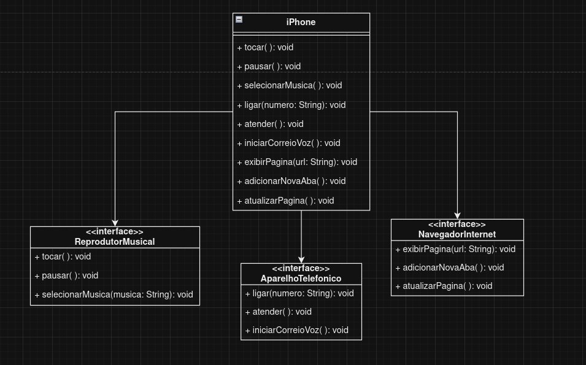

# Resolução do desafio de projeto "Modelagem e Diagramação de um Componente iPhone" da DIO
www.dio.me

#### Resolução por
- [joaopespindola](https://github.com/joaopespindola)

#### Autores
- [Gleyson Sampaio](https://github.com/glysns)

## POO - Desafio

### Modelagem e Diagramação de um Componente iPhone

A classe Main deste projeto implementa uma interface simples para interagir com um "iPhone". Ao executar o programa, você terá um menu interativo 
no console onde pode escolher entre as seguintes opções:

    Reprodutor Musical: Você pode reproduzir música, pausar a reprodução ou selecionar uma música específica digitando seu nome.

    Aparelho Telefônico: Você pode fazer uma ligação inserindo um número, atender chamadas recebidas ou iniciar o correio de voz.

    Navegador na Internet: Você pode digitar uma URL para exibir uma página web, adicionar uma nova aba de navegação ou atualizar a página atual.

    Sair: Encerra o programa.

